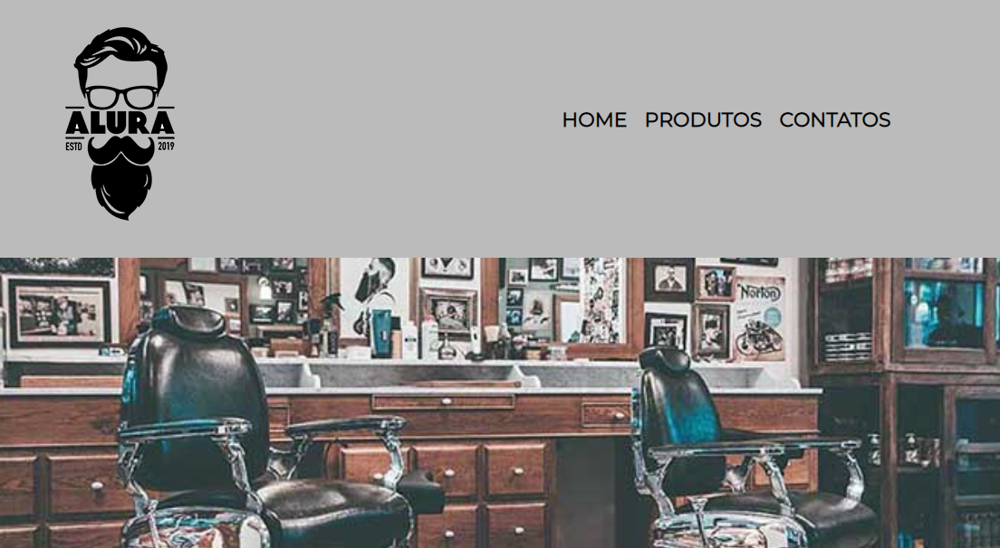

<h1 align="center">
  
</h1>

  <a href="#-tecnologias">Tecnologias</a>&nbsp;&nbsp;&nbsp;|&nbsp;&nbsp;&nbsp;
  <a href="#-projeto">Projeto</a>&nbsp;&nbsp;&nbsp;|&nbsp;&nbsp;&nbsp;
  <a href="#-incremento">Incremento</a>&nbsp;&nbsp;&nbsp;

 

  

## 🚀 Tecnologias

Esse projeto foi desenvolvido com as seguintes tecnologias:

- HTML
- CSS

## 💻 Projeto

O projeto foi desenvolvido no curso básico de HTML5 e CSS3 da plataforma Alura. Onde abordamos conceitos de HTML semântico, CSS básico como sombras e posicionamentos. Linkando vídeo do YouTube e Google Maps.

## 🚀 Incremento
Em breve...

---

Feito com 💜 👋 [Check out my LinkedIn](https://www.linkedin.com/in/william-souza-0967337b/)